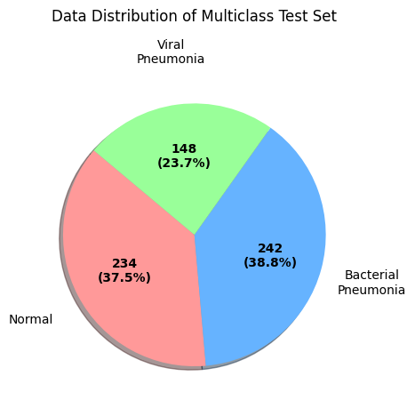

# pneumonia_classification

WID3011 Deep Learning Group Assignment

# Dataset source

https://www.kaggle.com/datasets/paultimothymooney/chest-xray-pneumonia

# Setup

1. Download the dataset from the above website
2. Extract the train, test, validation folders from the zip file
3. Create a folder named 'dataset' and insert the folders into the 'dataset' folder

# Data Preprocessing

## Steps:
1. Requirements
    - Please install the requirements needed according to the **requirements.txt** for data preprocessing purpose.

2. Preprocessing Functions
    - Open **utils.py** to review the preprocessing functions applied to the images, including resizing, histogram equalization, Gaussian blur, bilateral filtering, adaptive masking, Otsu thresholding, and the Scharr operator for edge detection.

3. Dataset Segmentation and Image Sampling
    - In **main.py**, you’ll find functions for organizing the dataset into train, test, and val folders, each containing images categorized as normal lung, bacterial infection, and viral infection. There is also a debug function to sample images from the dataset, enabling you to inspect the images after each preprocessing step.

4. Creating the Final Dataset for Training
    - The main function in **main.py** saves all preprocessed images into a modified_dataset folder, which will be used for training. Each step is labeled as "first," "second," and "third" to guide the processing order. You can choose to run all steps sequentially at once if preferred.

## Data Description
### Dataset Overview
The chest X-ray dataset containing a total of 5,856 X-ray images, structured into three main folders:
- `train/`: Training dataset
- `test/`: Testing dataset
- `val/`: Validation dataset
<br/>

**Train:** 5,216 images<br/>
**Test:** 624 images<br/>
**Validation:** 16 images<br/>


<hr/>

**Normal:** 1,583 images<br/>
**Bacterial Pneumonia:** 2,780 images<br/>
**Viral Pneumonia:** 1,493 images<br/>


### Dataset Modifications
To ensure proper representation in the validation set, 200 viral pneumonia images were randomly selected from the training folder and moved to the validation folder. This modification was made to address the initial lack of viral pneumonia cases in the validation set. 192 normal images and 192 bacterial pneumonia images were randomly selected from the training folder and added to the validation set. This ensures that our validation set now has 200 images each for normal, bacterial pneumonia, and viral pneumonia cases, making it more balanced and representative.

### Data Distribution
#### Re-Categorised Dataset:


#### Training Set (Total: 5,208 images)
**Normal:** 1,149 images (24.8.7%)<br/>
**Bacterial Pneumonia:** 2,338 images (50.5%)<br/>
**Viral Pneumonia:** 1,145 images (24.7%)<br/>


#### Testing Set (Total: 624 images)
**Normal:** 234 images (37.5%)<br/>
**Bacterial Pneumonia:** 242 images (38.8%)<br/>
**Viral Pneumonia:** 148 images (23.7%)<br/>



#### Validation Set (Total: 24 images)
**Normal:** 8 images (33.3%)<br/>
**Bacterial Pneumonia:** 8 images (33.3%)<br/>
**Viral Pneumonia:** 8 images (33.3%)<br/>


### Directory Structure
```
Original Dataset/               Current Dataset/
├── train/                      ├── train/
│   ├── NORMAL/                 │   ├── NORMAL/
│   └── PNEUMONIA/              │   ├── BACTERIA/
├── test/                       │   └── VIRUS/
│   ├── NORMAL/                 ├── test/
│   └── PNEUMONIA/              │   ├── NORMAL/
└── val/                        │   ├── BACTERIA/
    ├── NORMAL/                 │   └── VIRUS/
    └── PNEUMONIA/              └── val/
                                   ├── NORMAL/
                                   ├── BACTERIA/
                                   └── VIRUS/
```

## Reference:
- Pre-processing Methods in Chest X-Ray Image Classification: https://pmc.ncbi.nlm.nih.gov/articles/PMC8982897/pdf/pone.0265949.pdf
- Chest X-Ray Image Preprocessing for Disease Classification: https://www.sciencedirect.com/science/article/pii/S1877050921015556
